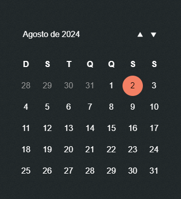

# Calendário Interativo

Este projeto é um calendário interativo criado utilizando HTML, CSS (com SASS e o padrão BEM com SMACSS) e JavaScript (paradigma orientado a classes). O objetivo é fornecer uma experiência de usuário intuitiva e agradável para navegação e seleção de datas.

## Funcionalidades

- **Navegação Mensal**: Permite navegar entre os meses anterior e seguinte.
- **Seleção de Data**: Permite definir o ano e selecionar o mês desejado.
- **Visualização Atual**: Destaca o mês e o ano atuais no calendário.
- **Interface de Dialog**: Fornece uma interface para selecionar o ano e o mês.

## Imagens

### Interface da Calculadora



## Como Usar

1. **Inicialização do Calendário**:
   Ao carregar a página, o calendário será exibido automaticamente com a data atual.

2. **Navegação Entre Meses**:

   - Clique no botão com o ícone "⯅" para visualizar o mês anterior.
   - Clique no botão com o ícone "⯆" para visualizar o próximo mês.

3. **Acessar o Dialog de Seleção**:

   - Clique no botão que exibe o nome do mês e ano atual para abrir um dialog.
   - No dialog, você pode selecionar o mês clicando nos botões correspondentes à abreviação do mês (ex: "Jan" para Janeiro, "Fev" para Fevereiro, etc.).
   - Insira o ano desejado no campo de entrada.

4. **Confirmar Seleção**:
   - Clique no botão "OK" para aplicar a seleção de mês e ano.
   - Clique no botão "Cancelar" ou fora da área do dialog para fechar o dialog sem aplicar as alterações.

## Estrutura do Projeto

- **HTML**: Define a estrutura básica do calendário e do dialog.
- **CSS**: Utiliza SASS para estilizar o calendário com o padrão BEM para garantir uma estrutura modular e o SMACSS para organização.
- **JavaScript**: Implementa a lógica do calendário usando o paradigma orientado a classes. A classe `Calendar` é responsável por:
  - Inicializar o calendário com base na data atual.
  - Gerenciar a navegação entre meses.
  - Mostrar e fechar o dialog para seleção de data.
  - Atualizar o calendário com base nas seleções do usuário.

## Instalar e Monitorar SASS

Instala a ferramenta de linha de comando global do SASS e começa a monitorar o arquivo `scss/style.scss`, compilando-o para `css/style.css` sempre que alterações forem detectadas.

```bash
npm install -g sass
sass --watch scss/style.scss:css/style.css
```

## Instalar e Monitorar TypeScript

Instala a ferramenta de linha de comando global do TypeScript e começa a monitorar o arquivo `script/main.ts`, compilando-o para ECMAScript 2022 sempre que alterações forem detectadas.

```bash
npm install -g tsc
tsc --target es2022 --watch script/main.ts
```

## Link do GitHub Pages

[GitHub Pages](https://joabsondev.github.io/calendar/).

---

⌨️ com ❤️ por [Joabson Silva](https://github.com/JoabsonDev) 😊
